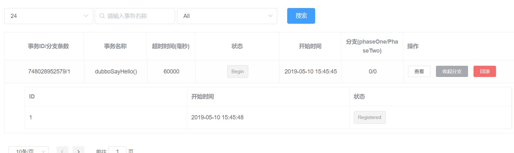

# springboot-dubbo-nacos

使用最新的dubbo2.7.1集成最新的seata0.5.1，nacos1.0.0，skywalking6.1.0

springboot-dubbo集成nacos注册中心和配置中心demo

最新dubbo-spring-boot-starter包在:https://oss.sonatype.org/content/repositories/snapshots

# 集成skywalking

* skywalking版本6.1.0
* dubbo版本2.7.1

* java运行的集成程序包下载：http://skywalking.apache.org/downloads/

修改：H:\apache-skywalking-apm-incubating\agent\config\agent.config collector.backend_service地址

skywalking在每个jar启动参数添加：-javaagent:D:/apache-skywalking-apm-bin/agent/skywalking-agent.jar=agent.service_name=Dubbo-Spring-Boot

# 集成seata

* seata版本0.5.1
* dubbo版本2.7.1
* nacos版本1.0.0

模拟分布式事物回滚放开代码中的int a = 1/0;

分布式事物支持单库和多库，多库的话每个库都需要添加undo_log表AT模式事务需要呀

> taas分布式集群事务集成seata和监控和界面管理事务回滚提交

```java
seata有个可视化界面是集群的 对机器要求非常高2H4G至少：https://github.com/seata/awesome-seata/blob/master/wiki/zh-cn/Seata%E5%88%86%E5%B8%83%E5%BC%8FGo%20Server%E6%AD%A3%E5%BC%8F%E5%BC%80%E6%BA%90.md
https://github.com/seata/taas
Git clone https//github.com/seata/taas.git
Docker-compose up -d
体验地址：http://39.97.115.141:8084/ui/index.html
体验seata集群地址：39.97.115.141:8091
```

在代码中打上断点 查看Xid的分片信息 去界面查看会出现呀

```java
log.info("全局事务Xid：" + RootContext.getXID());
全局事务Xid：66:5339097333763
```



taas有监控：grafana中添加prometheus地址后导入github中的json监控事务

> taas分布式集群事务集成seata和监控和界面管理事务回滚提交